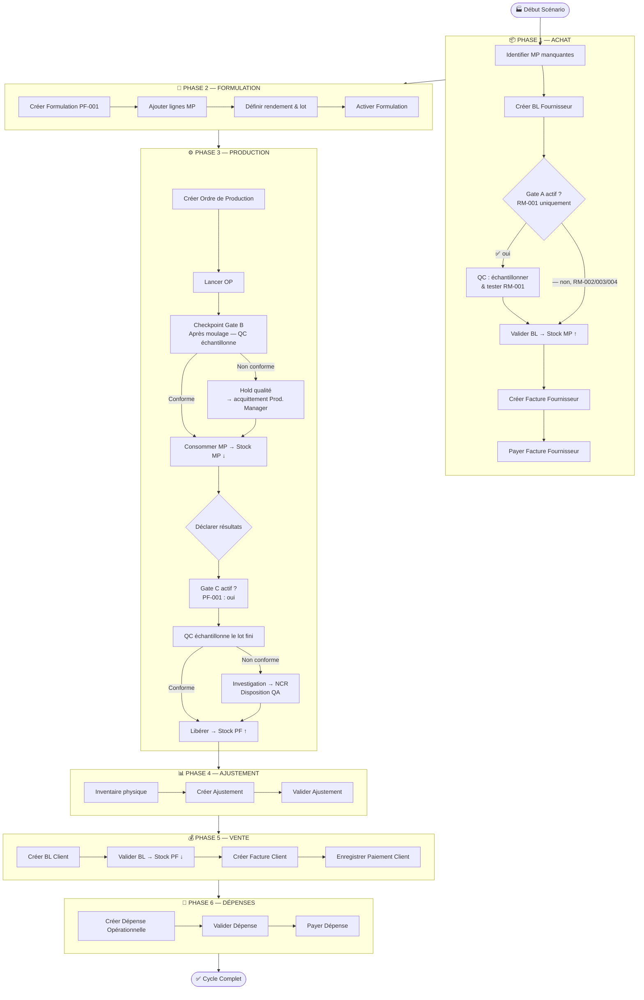
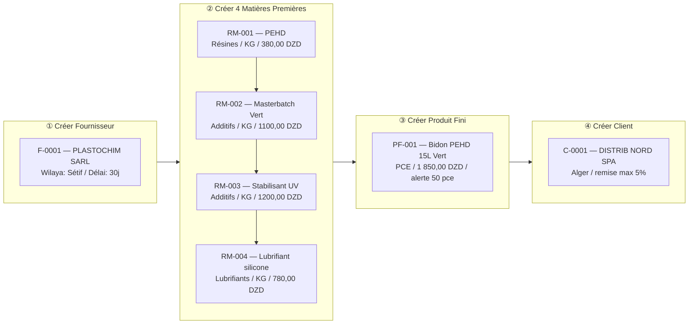
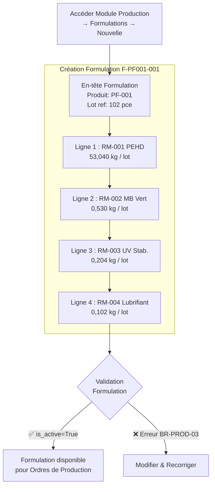
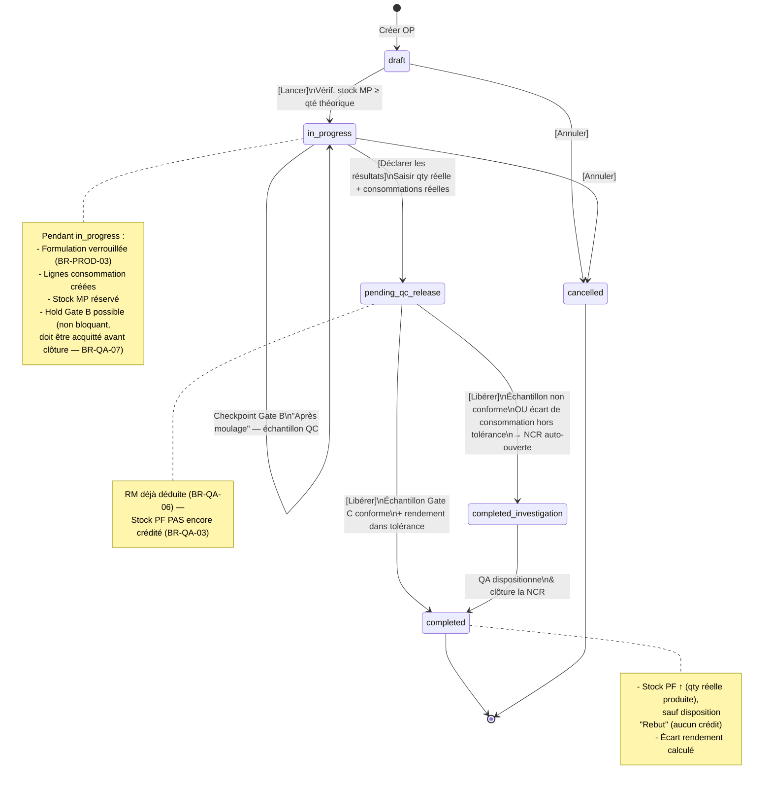
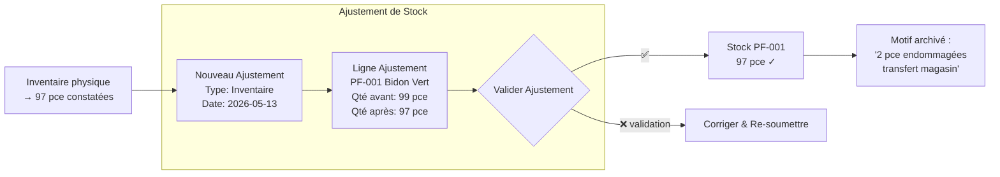
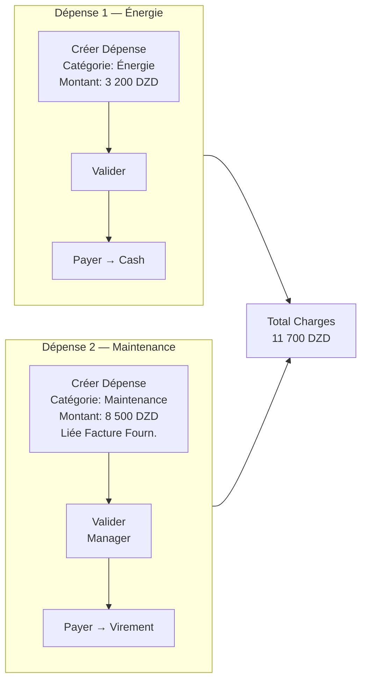
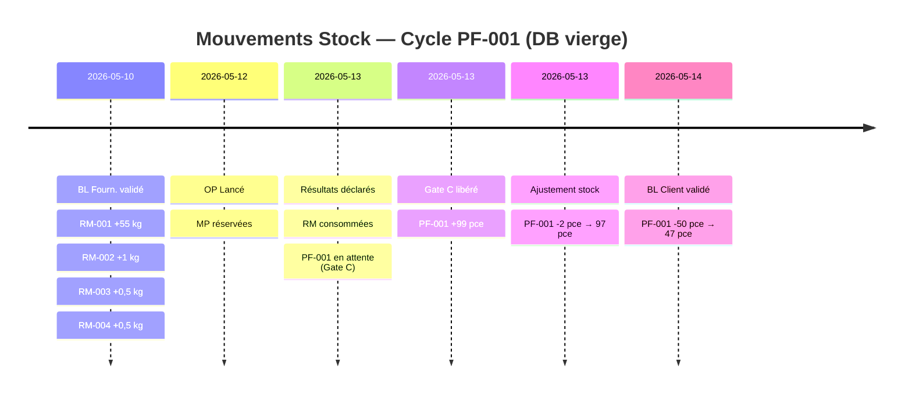
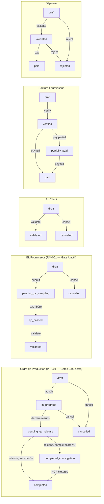

# UsineERP — Scénario Complet : Bidon PEHD 15L Vert

## Cycle Intégral : Achat → QA/QC Gate A → Formulation → Production (Gates B/C) → Ajustement → Vente → Dépenses

> **Document** : Spécification fonctionnelle d'exécution  
> **Produit fini cible** : `PF-001 — Bidon PEHD 15L Vert`  
> **Lot de référence** : 100 unités  
> **Généré le** : 2026-05-08 — **Mis à jour** : module QA/QC (Gates A/B/C) intégré

---

## Table des matières

1. [Vue d'ensemble du cycle](#1-vue-densemble-du-cycle)
2. [Données de référence](#2-données-de-référence)
3. [Phase 1 — Achat & Réception](#3-phase-1--achat--réception)
4. [Phase 2 — Formulation](#4-phase-2--formulation)
5. [Phase 3 — Ordre de Production](#5-phase-3--ordre-de-production)
6. [Phase 4 — Ajustement de Stock](#6-phase-4--ajustement-de-stock)
7. [Phase 5 — Vente & Livraison Client](#7-phase-5--vente--livraison-client)
8. [Phase 6 — Dépenses](#8-phase-6--dépenses)
9. [Flux financier consolidé](#9-flux-financier-consolidé)
10. [Règles métier applicables](#10-règles-métier-applicables)
11. [Module QA/QC — Laboratoire (Gates A/B/C)](#11-module-qaqc--laboratoire-gates-abc)

---

## 1. Vue d'ensemble du cycle



---

## 2. Données de référence

### 2.0 Site de production (multi-site — §25.2)

> Le module `ProductionSite` (fonc. spec §25.2) scope certains documents — BL Fournisseur,
> Ordre de Production, Ajustement de Stock, BL Client — à un site physique. Aucune action
> manuelle n'est requise pour ce scénario mono-site : la migration de données
> `core.0004_seed_main_site` crée automatiquement le site ci-dessous sur toute DB vierge, et
> chaque formulaire concerné s'en sert comme valeur par défaut.

| Champ | Valeur          |
| ----- | --------------- |
| Code  | `MAIN`          |
| Nom   | Site Principal  |
| Actif | Oui             |

### 2.1 Produit fini

| Champ                         | Valeur              |
| ----------------------------- | ------------------- |
| Référence                     | `PF-001`            |
| Désignation                   | Bidon PEHD 15L Vert |
| Unité de vente                | Pièce (pce)         |
| Prix de vente de référence HT | **1 850,00 DZD**    |
| Seuil d'alerte stock          | 50 pce              |

### 2.2 Fournisseur

| Champ                  | Valeur          |
| ---------------------- | --------------- |
| Code                   | `F-0001`        |
| Raison sociale         | PLASTOCHIM SARL |
| Wilaya                 | Sétif           |
| Conditions de paiement | 30 jours        |
| Devise                 | DZD             |

### 2.3 Client

| Champ                | Valeur           |
| -------------------- | ---------------- |
| Code                 | `C-0001`         |
| Raison sociale       | DISTRIB NORD SPA |
| Wilaya               | Alger            |
| Remise max autorisée | 5 %              |
| Statut crédit        | Actif            |

### 2.4 Bill of Materials — Lot de 100 Bidons PEHD 15L Vert

> ⚠️ **Base de données vierge** — après `--flush` + seed minimal, il n'existe **aucune matière première** en catalogue ni en stock. Toutes les MP ci-dessous doivent être **créées dans le Catalogue** puis **achetées et réceptionnées** avant toute production.

| Réf générée       | Désignation                     | Qté / lot 100 pce | Unité | Prix réf (DZD/kg) | Coût total DZD | Action requise            |
| ----------------- | ------------------------------- | ----------------- | ----- | ----------------- | -------------- | ------------------------- |
| `RM-001` _(auto)_ | Polyéthylène haute densité PEHD | **52,000**        | kg    | 380,00            | **19 760,00**  | Créer catalogue + Acheter |
| `RM-002` _(auto)_ | Masterbatch Vert PEHD           | **0,520**         | kg    | 1 100,00          | **572,00**     | Créer catalogue + Acheter |
| `RM-003` _(auto)_ | Stabilisant thermique UV        | **0,200**         | kg    | 1 200,00          | **240,00**     | Créer catalogue + Acheter |
| `RM-004` _(auto)_ | Lubrifiant silicone industriel  | **0,100**         | kg    | 780,00            | **78,00**      | Créer catalogue + Acheter |

> Les références `RM-NNN` sont auto-générées par `DocumentSequence` à la création dans le Catalogue. Les valeurs ci-dessus supposent une DB vierge (premier lot créé = RM-001, etc.).

**Coût matières total (lot 100 pce) : 20 650,00 DZD**  
**Coût matière unitaire : 206,50 DZD/pce**

> **Rendement attendu** : 98 % → pour 100 pce, prévoir 102 pce théoriques en lancement.

### 2.5 Module QA/QC — Données de référence

> Seedées par `seed_phase0_bidon_vert` (voir [Section 11](#11-module-qaqc--laboratoire-gates-abc)
> pour le détail complet). Deux comptes dédiés sont créés par `minimal_populate_db` :
> `qualite` (rôle `qa_manager`) et `laboratoire` (rôle `qc_technician`), mot de passe
> `admin1234`.

| Cible             | Propriété                | Nominal      | Tolérance | Critique | Gate(s) |
| ----------------- | ------------------------ | ------------ | --------- | -------- | ------- |
| RM-001 PEHD       | Indice de fluidité (MFI) | 8,00 g/10min | ± 15 %    | Oui      | A       |
| PF-001 Bidon Vert | Épaisseur de paroi       | 2,50 mm      | ± 10 %    | Oui      | B + C   |

> ⚠️ Seul un **Plan d'échantillonnage actif** déclenche un gate (BR-QA-01). RM-002, RM-003
> et RM-004 n'ont **aucun** plan Gate A : leur réception suit le flux inchangé, sans aucune
> action QC — c'est le comportement voulu, pas un oubli.

---

## 3. Phase 1 — Création Catalogue & Achat & Réception

> **Pré-requis absolu** : la DB est vierge. Avant tout achat, les 4 matières premières et le produit fini doivent exister dans le Catalogue. Le fournisseur et le client doivent également être créés.

### 3.0 Création du fournisseur, catalogue, client (étape préalable)



**Formulaires (RawMaterialForm × 4) :**

```
Module : Catalogue → Matières Premières → Nouvelle
Règle  : reference est auto-générée (editable=False) — ne pas saisir
         alert_threshold DOIT être > stockout_threshold (BR-CAT-03)

┌──────────────────────────────────────────────────────────────────────────────────┐
│ designation                   │ category             │ unit │ ref_price │ alert  │ rupture│
├───────────────────────────────┼──────────────────────┼──────┼───────────┼────────┼────────┤
│ Polyéthylène haute densité    │ Résines et polymères │ KG   │ 380,00    │ 20,000 │  5,000 │
│ Masterbatch Vert PEHD         │ Additifs et colorants│ KG   │ 1 100,00  │  0,500 │  0,100 │
│ Stabilisant thermique UV      │ Additifs et colorants│ KG   │ 1 200,00  │  0,500 │  0,100 │
│ Lubrifiant silicone industriel│ Lubrifiants ind.     │ KG   │    780,00 │  0,500 │  0,100 │
└───────────────────────────────┴──────────────────────┴──────┴───────────┴────────┴────────┘
→ Références auto-assignées : RM-001, RM-002, RM-003, RM-004

FinishedProductForm :
  designation             : Bidon PEHD 15L Vert
  sales_unit              : PCE
  reference_selling_price : 1 850,00
  alert_threshold         : 50,000
  → Référence auto : PF-001
```

### 3.1 Flux achat & réception — toutes les MP

```mermaid
flowchart LR
    subgraph BL["Bon de Livraison Fournisseur"]
        B1["Nouveau BL\nSite: Site Principal (MAIN)\nFournisseur: F-0001\nDate: 2026-05-10\nRéf: BL-PLASTOCHIM-2026-047"] --> B2
        B2["Ligne 1 — RM-001 PEHD\n55 kg @ 380 DZD"] --> B3
        B3["Ligne 2 — RM-002 MB Vert\n1 kg @ 1 100 DZD"] --> B4
        B4["Ligne 3 — RM-003 UV Stab.\n0,5 kg @ 1 200 DZD"] --> B5
        B5["Ligne 4 — RM-004 Lubrifiant\n0,5 kg @ 780 DZD"]
        B5 --> B5b[Soumettre]
    end

    subgraph QC["QA/QC Gate A — RM-001 uniquement"]
        B5b --> |plan actif RM-001| Q1["Statut → Pending QC Sampling"]
        Q1 --> Q2["QC : échantillon ECH-2026-0001\nMFI relevé 7,60 g/10min"]
        Q2 --> |dans tolérance 6,80–9,20| Q3["Conforme → QC Passed"]
        B5b --> |RM-002/003/004 : pas de plan| Q3
    end

    Q3 --> B6{Valider BL}

    subgraph STOCK["Impact Stock (tous à 0 → positif)"]
        B6 --> |✅| C1["RM-001 ↑ +55,000 kg"]
        B6 --> |✅| C2["RM-002 ↑  +1,000 kg"]
        B6 --> |✅| C3["RM-003 ↑  +0,500 kg"]
        B6 --> |✅| C4["RM-004 ↑  +0,500 kg"]
    end

    subgraph FACT["Facture Fournisseur"]
        C1 & C2 & C3 & C4 --> D1["Facture F-2026-0001\nHT: 22 990 DZD\nTVA 19%: 4 368 DZD\nTTC: 27 358 DZD\nÉchéance: 2026-06-09"]
        D1 --> D2["Paiement Virement\n27 358 DZD\n2026-05-15"]
    end
```



### 3.1bis QA/QC — Gate A détaillé (module Qualité / Laboratoire)

Exécuté automatiquement par `seed_phase1_supplier_bl_invoice_bidon_vert` — équivalent manuel
ci-dessous, à faire dans **Qualité → Échantillons** :

```
1. Soumettre le BL (bouton "Soumettre") :
     statut → "Pending QC Sampling" (BR-QA-01 : un plan Gate A actif existe sur RM-001)
     Les lignes RM-002/003/004 n'ont aucun plan → aucune action requise pour elles.

2. Sur la ligne RM-001 du BL, bouton [Prélever] (rôle laboratoire / qualite) :
     control_point          : A
     quality_specification  : RM-001 v1 (verrouillée au tirage — BR-QA-04)
     quantity_sampled       : 0,100 kg
     → Référence auto : ECH-2026-0001

3. Saisie des résultats (Qualité → Échantillons → ECH-2026-0001 → Saisir) :
     Indice de fluidité (MFI) : 7,60 g/10min
     → Calcul auto : nominal 8,00 ± 15 % = [6,80 ; 9,20] → 7,60 ∈ tolérance → Conforme

4. Bouton [Libérer le contrôle QC] (rôle qualite) :
     statut BL → "QC Passed"

5. Le Storekeeper valide le BL normalement (comme avant le module QA/QC) :
     statut BL → "Validated" → Stock RM-001 crédité +55 kg (les 3 autres lignes aussi,
     jamais bloquées puisqu'aucun plan Gate A ne les concerne).
```

> Si le résultat avait été hors tolérance (ex. MFI 5,20), l'échantillon serait passé
> `non_conforming`, une NCR aurait été **ouverte automatiquement**, et la ligne RM-001
> aurait été **exclue** du crédit de stock au moment de la validation (BR-QA-02) — sans
> bloquer les 3 autres lignes conformes.

### 3.2 Formulaire BL Fournisseur (`SupplierDNForm`)

```
Module     : EXPLOITATION → Fournisseurs → Bons de Livraison → [Nouveau]
Modèle     : SupplierDN

Champs à renseigner :
  site                 : Site Principal (MAIN)   ← nouveau champ (multi-site, §25.2) ; se pré-remplit
                          avec le dernier site utilisé par l'opérateur — laisser tel quel sur DB vierge
  external_reference  : "BL-PLASTOCHIM-2026-047"
  supplier            : F-0001 — PLASTOCHIM SARL
  delivery_date       : 2026-05-10
  remarks             : "Livraison matières lot Bidon Vert PF-001 — DB vierge init."

Lignes (SupplierDNLine × 4) :
  ┌────────────────────────────────────────────────────────────────────────┐
  │ raw_material          │ qty_received │ unit_of_measure │ agreed_price  │
  ├───────────────────────┼──────────────┼─────────────────┼───────────────┤
  │ RM-001 — PEHD         │ 55,000       │ KG              │ 380,00        │
  │ RM-002 — MB Vert      │  1,000       │ KG              │ 1 100,00      │
  │ RM-003 — UV Stab.     │  0,500       │ KG              │ 1 200,00      │
  │ RM-004 — Lubrifiant   │  0,500       │ KG              │   780,00      │
  └───────────────────────┴──────────────┴─────────────────┴───────────────┘

  Calcul HT :
    RM-001 : 55,000 × 380,00    = 20 900,00
    RM-002 :  1,000 × 1 100,00  =  1 100,00
    RM-003 :  0,500 × 1 200,00  =    600,00
    RM-004 :  0,500 ×   780,00  =    390,00
                                ───────────
    Total HT                    = 22 990,00 DZD

Action : [Valider] → status = "validated" → Stock RM mis à jour (de 0 → positif)
        → Référence interne générée : BL-F-MAIN-2026-0001 (embarque le code du site — §25.2.4)
```

### 3.3 Formulaire Facture Fournisseur (`SupplierInvoiceForm`)

```
Module  : EXPLOITATION → Fournisseurs → Factures → [Nouvelle]
Modèle  : SupplierInvoice

  external_reference  : "FACT-PLASTOCHIM-2026-047"
  supplier            : F-0001
  invoice_date        : 2026-05-10
  due_date            : 2026-06-09   ← +30 jours (BR-SUPP-01 : due_date ≥ invoice_date ✅)

Lignes (SupplierInvoiceLine × 4) :
  ┌────────────────────────────────────────────────────────────────────────────────┐
  │ raw_material │ designation          │ qty_invoiced │ unit_price │ total        │
  ├──────────────┼──────────────────────┼──────────────┼────────────┼──────────────┤
  │ RM-001       │ PEHD                 │ 55,000       │    380,00  │  20 900,00   │
  │ RM-002       │ Masterbatch Vert     │  1,000       │  1 100,00  │   1 100,00   │
  │ RM-003       │ Stabilisant UV       │  0,500       │  1 200,00  │     600,00   │
  │ RM-004       │ Lubrifiant silicone  │  0,500       │    780,00  │     390,00   │
  └──────────────┴──────────────────────┴──────────────┴────────────┴──────────────┘
  Sous-total HT : 22 990,00 DZD
  TVA 19 %      :  4 368,10 DZD
  Total TTC     : 27 358,10 DZD

Paiement (SupplierPayment) :
  payment_date    : 2026-05-15
  amount          : 27 358,10
  payment_method  : virement
  bank_reference  : "VIR-BDL-2026-0515-001"
```

---

## 4. Phase 2 — Formulation

### 4.1 Flux détaillé



> **Note BR-PROD-03** : une formulation ne peut plus être modifiée si un Ordre de Production est `in_progress`. La formulation est créée avant tout lancement.

### 4.2 Formulaire Formulation (`FormulationForm`)

```
Module  : PRODUCTION → Formulations → [Nouvelle]
Modèle  : Formulation

  designation           : "Formulation Bidon PEHD 15L Vert — v1.0"
  finished_product      : PF-001 — Bidon PEHD 15L Vert   ← référence DB vierge
  reference_batch_qty   : 102        ← 100 pce attendues + 2% marge rendement
  reference_batch_unit  : PCE
  expected_yield_pct    : 98,00      ← 98%
  technical_notes       : "Process soufflage extrusion. T° 210°C. Pression 8 bar."

Lignes (FormulationLine) :
  ┌────────────────────────────────────────────────────────────────────────────┐
  │ raw_material    │ qty_per_batch │ unit_of_measure │ tolerance_pct          │
  ├─────────────────┼───────────────┼─────────────────┼────────────────────────┤
  │ RM-001 PEHD     │ 53,040        │ KG              │ 2,00                   │
  │ RM-002 MB Vert  │  0,530        │ KG              │ 3,00                   │
  │ RM-003 UV Stab  │  0,204        │ KG              │ 5,00                   │
  │ RM-004 Lubr.    │  0,102        │ KG              │ 5,00                   │
  └─────────────────┴───────────────┴─────────────────┴────────────────────────┘

Action : [Enregistrer] → is_active = True
```

### 4.3 Calcul des quantités par lot (base 102 pce)

| Matière           | Qté/100 pce | Facteur (×1,02) | Qté/lot 102   | Tolérance | Min    | Max    |
| ----------------- | ----------- | --------------- | ------------- | --------- | ------ | ------ |
| RM-001 PEHD       | 52,000 kg   | ×1,02           | **53,040 kg** | ±2 %      | 51,979 | 54,101 |
| RM-002 MB Vert    | 0,520 kg    | ×1,02           | **0,530 kg**  | ±3 %      | 0,514  | 0,546  |
| RM-003 UV Stab    | 0,200 kg    | ×1,02           | **0,204 kg**  | ±5 %      | 0,194  | 0,214  |
| RM-004 Lubrifiant | 0,100 kg    | ×1,02           | **0,102 kg**  | ±5 %      | 0,097  | 0,107  |

### 4.4 Exemples supplémentaires — formulations multi-références (démo % du lot)

Trois autres formulations, chacune avec sa propre composition en matières
premières partagées (HD400, SR100, RT, GLOCO, LS, BIO, ANT, EAU). Le % de
chaque ligne = qté ligne / qté totale du lot × 100 — c'est ce même calcul
qui alimente la colonne "% du lot" du panneau de prévisualisation sur le
formulaire OP (§5.2) et de l'AJAX `formulation_scaling_ajax` (§5.3).

**Formulation 3020**

| Matière | Qté (kg) | % du lot | Prix (DZD/kg) | Coût total (DZD) |
| ------- | -------: | -------: | -------------: | ----------------: |
| HD400   |      400 |    38,8 %|             165 |          66 000,00 |
| SR100   |      130 |    12,6 %|             165 |          21 450,00 |
| RT      |       20 |     1,9 %|             120 |           2 400,00 |
| GLOCO   |       40 |     3,9 %|             250 |          10 000,00 |
| LS      |        0 |     0,0 %|             145 |               0,00 |
| BIO     |        1 |     0,1 %|             500 |             500,00 |
| ANT     |        1 |     0,1 %|             500 |             500,00 |
| EAU     |      440 |    42,6 %|               2 |             880,00 |
| **TOTAL** | **1 032** | **100 %** |            —  |     **101 730,00** |

> Coût unitaire moyen : 98,58 DZD/kg · Coût total (avec frais/marge) : 126 875,87 DZD

**Formulation 3010**

| Matière | Qté (kg) | % du lot | Prix (DZD/kg) | Coût total (DZD) |
| ------- | -------: | -------: | -------------: | ----------------: |
| HD400   |      300 |    33,6 %|             165 |          49 500,00 |
| SR100   |      130 |    14,6 %|             165 |          21 450,00 |
| RT      |       11 |     1,2 %|             120 |           1 320,00 |
| GLOCO   |       10 |     1,1 %|             250 |           2 500,00 |
| LS      |        0 |     0,0 %|             145 |               0,00 |
| BIO     |        1 |     0,1 %|             500 |             500,00 |
| ANT     |        1 |     0,1 %|             500 |             500,00 |
| EAU     |      440 |    49,3 %|               2 |             880,00 |
| **TOTAL** |   **893** | **100 %** |            —  |      **76 650,00** |

> Coût total (avec frais/marge, +30 %) : 123 942,67 DZD

**Formulation 4010**

| Matière | Qté (kg) | % du lot | Prix (DZD/kg) | Coût total (DZD) |
| ------- | -------: | -------: | -------------: | ----------------: |
| HD400   |      170 |    20,9 %|             165 |          28 050,00 |
| SR100   |      180 |    22,2 %|             165 |          29 700,00 |
| RT      |       20 |     2,5 %|             120 |           2 400,00 |
| GLOCO   |        0 |     0,0 %|             250 |               0,00 |
| LS      |        0 |     0,0 %|             145 |               0,00 |
| BIO     |        1 |     0,1 %|             500 |             500,00 |
| ANT     |        1 |     0,1 %|             500 |             500,00 |
| EAU     |      440 |    54,2 %|               2 |             880,00 |
| **TOTAL** |   **812** | **100 %** |            —  |      **62 030,00** |

> Coût total (avec frais/marge, +30 %) : 113 839,04 DZD

---

## 5. Phase 3 — Ordre de Production

> ⚠️ **Amendement module QA/QC** : `PF-001` a des plans d'échantillonnage actifs sur
> **Gate B** (checkpoint "Après moulage") et **Gate C** (libération finale). Le diagramme
> et le formulaire de clôture ci-dessous reflètent le flux **amendé** — l'ancienne clôture
> en un clic n'existe plus pour ce produit tant que ces plans restent actifs (BR-QA-01 :
> désactiver les deux plans restaurerait le flux d'origine).

### 5.1 Flux détaillé (amendé — Gates B & C actifs sur PF-001)



### 5.2 Formulaire Ordre de Production (`ProductionOrderForm`)

```
Module  : PRODUCTION → Ordres de Production → [Nouveau]
Modèle  : ProductionOrder

  site          : Site Principal (MAIN)   ← nouveau champ (multi-site, §25.2) ; la MP est
                   consommée depuis LE STOCK DE CE SITE et le PF y est crédité
  formulation   : "Formulation Bidon PEHD 15L Vert — v1.0"
  target_qty    : 100,000
  target_unit   : PCE   (équivalent kg : target_qty_kg = 52,820 kg, via
                         finished_product.effective_kg_per_unit = 0,5282 kg/pce)
  launch_date   : 2026-05-12
  notes         : "Lot PF-001 — commande client C-0001"

Action : [Enregistrer] → status = "draft"
         → Référence interne générée : OP-MAIN-2026-0001 (embarque le code du site — §25.2.4)
Action : [Lancer]      → status = "in_progress"
         ↳ Création automatique des ConsumptionLines (théoriques)
```

### 5.3 Lignes de consommation théoriques générées automatiquement

Masse totale du lot (Σ kg_equivalent des lignes) : **52,820 kg**. Le % de
chaque matière = sa quantité équivalente en kg / masse totale du lot × 100
(affiché en temps réel dans le panneau "Besoins théoriques en MP" du
formulaire OP, à côté de la quantité, dès que la formulation et la quantité
cible sont renseignées).

| Matière           | Qté théorique (calculée) | Unité | % du lot   | Stock avant  |
| ----------------- | ------------------------ | ----- | ---------- | ------------ |
| RM-001 PEHD       | 52,000 kg                | KG    | 98,45 %    | 55,000 kg ✅ |
| RM-002 MB Vert    | 0,520 kg                 | KG    | 0,98 %     | 1,000 kg ✅  |
| RM-003 UV Stab    | 0,200 kg                 | KG    | 0,38 %     | 0,500 kg ✅  |
| RM-004 Lubrifiant | 0,100 kg                 | KG    | 0,19 %     | 0,500 kg ✅  |

### 5.3bis QA/QC — Gate B (checkpoint mi-production)

Pendant que l'OP est `in_progress`, à un moment quelconque avant la déclaration des
résultats — typiquement juste après le moulage — un technicien QC prélève un échantillon
depuis la fiche de l'OP (bouton **[Prélever un échantillon]**, visible car un plan Gate B
actif existe sur PF-001) :

```
Qualité → Échantillons → [Prélever un échantillon] (depuis la fiche OP OP-MAIN-2026-0001)
  Formulaire "Prélever un échantillon — Gate B" (`SampleDrawForm`) :

    Point de contrôle suggéré : [Après moulage]  ← bouton, pré-remplit le champ ci-dessous
    Version de spécification (verrouillée — BR-QA-04) : PF-001 - Bidon PEHD 15L Vert — v1
                                                          ← seule version active, verrouillée
    Quantité échantillonnée   : 0,500
    Unité                     : KG
    Point de contrôle (Gate B) : "Après moulage"        ← rempli par le bouton suggéré

  [Enregistrer le prélèvement] → Référence auto : ECH-2026-0002
    → statut échantillon = "Résultats en attente" → redirection vers la saisie des résultats

Qualité → Échantillons → ECH-2026-0002 → Saisie des résultats (`TestResultForm`)
  Spécification verrouillée : PF-001 - Bidon PEHD 15L Vert — v1 (BR-QA-04)

  | Propriété             | Nominal / Limites | Critique | Valeur relevée | Instrument / méthode |
  |------------------------|--------------------|----------|-----------------|------------------------|
  | Épaisseur de paroi (mm)| 2,5000 ± 10,00 %   | Critique | 2,45            | Pied à coulisse        |

  [Enregistrer les résultats]
  → Calcul auto : nominal 2,50 ± 10 % = [2,25 ; 2,75] → 2,45 ∈ tolérance → Conforme

→ Aucune alerte levée. L'OP reste in_progress sans interruption.
```

> Si le relevé était sorti de tolérance (ex. 2,05 mm), l'échantillon serait passé
> `non_conforming`, un **hold qualité non bloquant** apparaîtrait sur l'OP (bandeau rouge
> sur la fiche), et le Responsable Production devrait l'**acquitter** (avec une note)
> avant de pouvoir déclarer les résultats — sans jamais annuler la production en cours,
> puisqu'un lot physique ne peut pas être "démoulé" (BR-QA-07).

### 5.4 Formulaire de déclaration des résultats (`ProductionOrderCloseForm`, amendé)

> Ce formulaire ne clôture plus l'OP en un clic pour PF-001 : il **déclare** les résultats
> de production. La consommation MP est déduite immédiatement (BR-QA-06) ; le stock PF
> n'est crédité qu'après la libération Gate C ci-dessous (BR-QA-03).

```
Action : [Déclarer les résultats]

  actual_qty_produced : 99,000    ← 1 pce rebutée (rendement réel 97,06%)
  notes               : "1 unité rebutée — défaut de soufflage"

Consommations réelles saisies :
  consumption_<id_RM001> : 52,500 kg   ← légèrement supérieur au théorique
  consumption_<id_RM002> :  0,525 kg
  consumption_<id_RM003> :  0,200 kg
  consumption_<id_RM004> :  0,102 kg

Résultat immédiat :
  Statut OP              : "Pending QC Release" (plan Gate C actif sur PF-001)
  Stock RM-001 ↓ -52,500 kg  (reste : 2,500 kg)   ← déduit tout de suite (BR-QA-06)
  Stock RM-002 ↓  -0,525 kg  (reste : 0,475 kg)
  Stock RM-003 ↓  -0,200 kg  (reste : 0,300 kg)
  Stock RM-004 ↓  -0,102 kg  (reste : 0,398 kg)
  Stock PF-001            : INCHANGÉ — pas encore crédité (BR-QA-03)
```

### 5.4bis QA/QC — Gate C (libération finale)

```
Qualité → Échantillons → [Prélever un échantillon] (depuis l'OP, statut "Pending QC Release")
  Formulaire "Prélever un échantillon — Gate C" (`SampleDrawForm`, pas de "Point de
  contrôle suggéré" — checkpoints nommés réservés à Gate B) :

    Version de spécification (verrouillée — BR-QA-04) : PF-001 - Bidon PEHD 15L Vert — v1
    Quantité échantillonnée   : 1,000
    Unité                     : PCE
    Point de contrôle (Gate B) : (laissé vide — non applicable à Gate C)

  [Enregistrer le prélèvement] → Référence auto : ECH-2026-0003

Qualité → Échantillons → ECH-2026-0003 → Saisie des résultats (`TestResultForm`)
  | Propriété             | Nominal / Limites | Critique | Valeur relevée |
  |------------------------|--------------------|----------|-----------------|
  | Épaisseur de paroi (mm)| 2,5000 ± 10,00 %   | Critique | 2,48            |

  [Enregistrer les résultats]
  → nominal 2,50 ± 10 % → Conforme

Vérification quantitative (automatique, basée sur les ConsumptionLines) :
  RM-001 : 52,500 / 52,000 = +0,96 % (tolérance ±2 %) → OK
  RM-002 :  0,525 /  0,520 = +0,96 % (tolérance ±3 %) → OK
  RM-003 :  0,200 /  0,204 = -1,96 % (tolérance ±5 %) → OK
  RM-004 :  0,102 /  0,102 =  0,00 % (tolérance ±5 %) → OK
  → yield_status = "normal" (97,06 %) → aucune revue obligatoire (BR-QA-10)

Bouton [Libérer / Statuer] (rôle qualite) :
  → Échantillon conforme + écarts dans tolérance → LIBÉRATION DIRECTE
  Statut OP  : "Completed"
  Stock PF-001 ↑ +99,000 pce
```

> **Chemin alternatif — investigation** : si l'échantillon avait échoué OU si un écart de
> consommation avait dépassé sa tolérance (ex. RM-001 à +6 %), l'OP serait passé à
> `Completed — Under Investigation`, une **NCR aurait été auto-ouverte** et pré-remplie
> avec les écarts détectés, et le stock PF-001 serait resté à 0 jusqu'à ce que le
> Responsable QA analyse, dispositionne (Rework / Rebut / Accepter avec dérogation) et
> clôture la NCR. Une disposition "Rebut" ne crédite jamais le stock PF (BR-QA-03).

### 5.5 Analyse de rendement

| Indicateur                   | Valeur            |
| ---------------------------- | ----------------- |
| Quantité cible               | 100 pce           |
| Quantité réellement produite | **99 pce**        |
| Rendement théorique formulé  | 98,00 %           |
| Rendement réel               | **97,06 %**       |
| Écart rendement              | −0,94 %           |
| Coût matière réel / lot      | **20 731,50 DZD** |
| Coût matière réel / pce      | **209,41 DZD**    |

---

## 6. Phase 4 — Ajustement de Stock

> **Contexte** : après inventaire physique, on constate que 2 bidons ont été endommagés lors du transfert vers le magasin produits finis. Le stock physique réel est **97 pce** au lieu de 99 pce.

### 6.1 Flux détaillé



### 6.2 Formulaire Ajustement (`StockAdjustmentForm`)

```
Module  : STOCK → Ajustements → [Nouveau]
Modèle  : StockAdjustment

  site            : Site Principal (MAIN)   ← nouveau champ (multi-site, §25.2) ; détermine
                     QUEL solde de stock est lu pour l'auto-remplissage ci-dessous
  adjustment_type : "inventory"
  adjustment_date : 2026-05-13
  reason          : "Inventaire physique post-production — 2 pce PF-001 endommagées
                     lors transfert magasin (impact physique, non conformes)"

Ligne (StockAdjustmentLine) :
  finished_product : PF-001 — Bidon PEHD 15L Vert
  raw_material     : (vide)
  quantity_before  : 99,000   ← auto-rempli depuis FinishedProductStockBalance
                     (site=Site Principal, finished_product=PF-001)
  quantity_after   : 97,000
  remarks          : "2 unités non conformes — mise au rebut"

Action : [Valider] → Stock PF-001 = 97 pce (au site Site Principal / MAIN)
         → Référence interne générée : ADJ-MAIN-2026-0001 (embarque le code du site — §25.2.4)
```

---

## 7. Phase 5 — Vente & Livraison Client

### 7.1 Flux détaillé

```mermaid
flowchart TD
    A[Commande client reçue\nC-0001 : 50 pce PF-001] --> B

    subgraph BLC["Bon de Livraison Client"]
        B[Nouveau BL Client\nSite: Site Principal (MAIN)\nClient: C-0001\nDate: 2026-05-14\nRemise: 3%] --> C
        C["Ligne BL\nPF-001 Bidon Vert\n50 pce\n@ 1 795,00 DZD HT\n(prix réf - remise 3%)"] --> D
        D{Valider BL Client}
        D --> |✅| E[Stock PF-001 ↓ -50 pce\nReste: 47 pce]
        D --> |❌ remise > max| F[Réduire remise ≤ 5%]
    end

    subgraph FACT["Facturation Client"]
        E --> G[Créer Facture Client\nliée au BL\nDate: 2026-05-14]
        G --> H["Montant HT : 89 750,00\nTVA 19% : 17 052,50\nTotal TTC : 106 802,50 DZD"]
        H --> I[Envoyer Facture]
    end

    subgraph PAY["Paiement"]
        I --> J[Encaissement Virement\n2026-05-20\n106 802,50 DZD]
        J --> K[Solde Client : 0 DZD]
    end
```

### 7.2 Formulaire BL Client (`ClientDNForm`)

```
Module  : VENTES → Bons de Livraison → [Nouveau]
Modèle  : ClientDN

  site          : Site Principal (MAIN)   ← nouveau champ (multi-site, §25.2) ; BR-CDN-02
                   (stock suffisant) est vérifiée SUR CE SITE uniquement
  client        : C-0001 — DISTRIB NORD SPA
  delivery_date : 2026-05-14
  discount_pct  : 3,00   ← ≤ max_discount_pct du client (5%) ✅
  remarks       : "Livraison 50 bidons verts — commande ref CMD-C0001-0514"

Ligne (ClientDNLine) :
  ┌──────────────────────────────────────────────────────────────────────────┐
  │ finished_product     │ qty_delivered │ unit  │ selling_unit_price_ht     │
  ├──────────────────────┼───────────────┼───────┼───────────────────────────┤
  │ PF-001 Bidon Vert    │ 50,000        │ pce   │ 1 795,00                  │
  └──────────────────────┴───────────────┴───────┴───────────────────────────┘
  Prix réf: 1 850,00 × (1 - 3%) = 1 794,50 → arrondi 1 795,00 DZD HT

Action : [Valider] → status = "validated" → Stock PF-001 ↓ 50 pce (au site Site Principal / MAIN)
         → Référence interne générée : BL-C-MAIN-2026-0001 (embarque le code du site — §25.2.4)
```

> **Règle BR appliquée** : `discount_pct (3%) ≤ client.max_discount_pct (5%)` → OK.  
> Si dépassement, `ClientDNForm.clean()` lève une `ValidationError`.

### 7.3 Facture et paiement client

```
Facture Client (ClientInvoice) :
  client         : C-0001
  invoice_date   : 2026-05-14
  discount_pct   : 3,00
  payment_method : virement

  Sous-total HT  :  89 750,00 DZD
  TVA 19 %       :  17 052,50 DZD
  Total TTC      : 106 802,50 DZD

Paiement (ClientPayment) :
  payment_date   : 2026-05-20
  amount         : 106 802,50
  payment_method : virement
  bank_reference : "VIR-BDL-C0001-20052026"
```

---

## 8. Phase 6 — Dépenses

> **Contexte** : enregistrement des charges opérationnelles liées à ce lot de production (énergie, maintenance machine).

### 8.1 Flux détaillé



### 8.2 Formulaire Dépense (`ExpenseForm`)

```
Dépense 1 — Consommation électrique four
  expense_date            : 2026-05-13
  category                : "Énergie & Utilities"
  description             : "Consommation électrique four soufflage — lot PF-001 — 2026-05-12"
  amount                  : 3 200,00
  beneficiary             : "SONELGAZ"
  linked_supplier_invoice : (vide)

Dépense 2 — Maintenance préventive machine
  expense_date            : 2026-05-13
  category                : "Maintenance"
  description             : "Entretien préventif machine soufflage — pièces + main d'œuvre"
  amount                  : 8 500,00
  beneficiary             : "TECH-MAINT EURL"
  linked_supplier_invoice : FACT-PLASTOCHIM-... (optionnel si facture séparée)

Validation (ExpenseValidationForm) :
  action           : "validate"
  rejection_reason : (vide)

Paiement Dépense 1 (ExpensePaymentForm) :
  payment_date    : 2026-05-14
  payment_method  : cash
  bank_reference  : (vide)

Paiement Dépense 2 :
  payment_date    : 2026-05-14
  payment_method  : virement
  bank_reference  : "VIR-MAINT-14052026"
```

---

## 9. Flux financier consolidé

### 9.1 Récapitulatif des flux

```mermaid
sankey-beta
  Encaissements,Vente BL Client,106802.50
  Décaissements,Achat MP Fournisseur,27358.10
  Décaissements,Dépense Énergie,3200.00
  Décaissements,Dépense Maintenance,8500.00
```

### 9.2 Compte de résultat simplifié — Lot PF-001

| Poste                                          | Montant (DZD) |
| ---------------------------------------------- | ------------- |
| **Chiffre d'affaires HT** (50 pce × 1 795 DZD) | **89 750,00** |
| — Coût MP total lot proratisé (50/97)          | −10 686,09    |
| — Dépenses opérationnelles (énergie + maint.)  | −11 700,00    |
| **Marge brute estimée**                        | **67 363,91** |
| **Marge brute %**                              | **~75 %**     |

> _Note : le coût matière réel du lot est 20 731,50 DZD proratisé sur 50 pce vendues / 97 pce produites._

### 9.3 Tableau de bord des mouvements de stock



---

## 10. Règles métier applicables

### 10.1 Tableau des Business Rules activées dans ce scénario

| Règle           | Module       | Description                                                                                     | Point d'application                |
| --------------- | ------------ | ----------------------------------------------------------------------------------------------- | ---------------------------------- |
| **BR-CAT-01**   | Catalog      | `reference` RM/PF auto-générée, immuable                                                        | `RawMaterial.save()`               |
| **BR-CAT-02**   | Catalog      | `unit_of_measure` immuable si MP référencée                                                     | `RawMaterialForm.__init__()`       |
| **BR-CAT-03**   | Catalog      | `alert_threshold > stockout_threshold`                                                          | `RawMaterialForm.clean()`          |
| **BR-PROD-03**  | Production   | Formulation verrouillée si OP `in_progress`                                                     | `FormulationForm.clean()`          |
| **BR-SALES-01** | Sales        | `discount_pct ≤ client.max_discount_pct`                                                        | `ClientDNForm.clean()`             |
| **BR-SALES-02** | Sales        | Stock PF suffisant avant validation BL                                                          | `ClientDN.validate()`              |
| **BR-EXP-01**   | Expenses     | Montant dépense > 0                                                                             | `ExpenseForm.clean_amount()`       |
| **BR-EXP-02**   | Expenses     | Motif rejet obligatoire si action = reject                                                      | `ExpenseValidationForm.clean()`    |
| **BR-SUPP-01**  | Supplier Ops | `due_date ≥ invoice_date`                                                                       | `SupplierInvoiceForm.clean()`      |
| **BR-STOCK-01** | Stock        | Exactement 1 MP ou 1 PF par ligne ajust.                                                        | `StockAdjustmentLineForm.clean()`  |
| **BR-AUD-01**   | Accounts     | Toute action tracée dans AuditLog                                                               | `AuditLog.log_action()`            |
| **BR-QA-01**    | Qualité      | Un gate n'est actif que si un Plan d'échantillonnage l'est aussi — sinon comportement inchangé  | `SamplingPlan.get_active_for()`    |
| **BR-QA-02**    | Qualité      | Aucune quantité d'une ligne BL Gate A non conforme n'est créditée en stock MP                   | `supplier_ops.signals`             |
| **BR-QA-03**    | Qualité      | Stock PF non crédité tant que l'OP est `Pending QC Release` / `Completed — Under Investigation` | `production.signals`               |
| **BR-QA-04**    | Qualité      | Chaque échantillon verrouille la version de spécification active au tirage                      | `Sample.quality_specification`     |
| **BR-QA-06**    | Qualité      | La déduction MP à la consommation réelle est indépendante du résultat Gate B/C                  | `ProductionOrderLine.save()`       |
| **BR-QA-07**    | Qualité      | Un OP ne peut pas être clôturé proprement avec un hold Gate B non acquitté                      | `ProductionOrder.close()`          |
| **BR-QA-10**    | Qualité      | Un `yield_status` critique déclenche toujours une NCR obligatoire à Gate C                      | `ProductionOrder.release_gate_c()` |

### 10.2 Transitions de statut critiques



### 10.3 Rôles utilisateurs requis par phase

| Phase                  | Action                                           | Rôle minimum requis             |
| ---------------------- | ------------------------------------------------ | ------------------------------- |
| 1 — Achat              | Valider BL Fournisseur                           | `manager` ou `stock_prod`       |
| 1 — Achat              | Créer Facture Fournisseur                        | `manager` ou `accountant`       |
| 1 — Achat (QA/QC)      | Prélever / saisir résultat échantillon Gate A    | `qa_manager` ou `qc_technician` |
| 1 — Achat (QA/QC)      | Libérer le contrôle QC (Gate A)                  | `qa_manager` (ou `manager`)     |
| 2 — Formulation        | Créer/modifier Formulation                       | `manager`                       |
| 3 — Production         | Lancer / Déclarer résultats OP                   | `manager` ou `stock_prod`       |
| 3 — Production (QA/QC) | Prélever / saisir résultat échantillon Gate B/C  | `qa_manager` ou `qc_technician` |
| 3 — Production (QA/QC) | Acquitter un hold Gate B                         | `stock_prod` ou `qa_manager`    |
| 3 — Production (QA/QC) | Libérer Gate C / dispositionner-clôturer une NCR | `qa_manager` (ou `manager`)     |
| 4 — Ajustement         | Valider Ajustement Stock                         | `manager` ou `stock_prod`       |
| 5 — Vente              | Créer BL Client                                  | `manager` ou `sales`            |
| 5 — Vente              | Créer Facture Client                             | `manager` ou `accountant`       |
| 6 — Dépenses           | Valider Dépense (montant élevé)                  | `manager` uniquement            |

---

## 11. Module QA/QC — Laboratoire (Gates A/B/C)

Cette section résume, en un seul endroit, tout ce que le module QA/QC ajoute au cycle
Bidon PEHD 15L Vert. Le détail pas-à-pas de chaque gate est dans les sections
[3.1bis](#31bis-qaqc--gate-a-détaillé-module-qualité--laboratoire),
[5.3bis](#53bis-qaqc--gate-b-checkpoint-mi-production) et
[5.4bis](#54bis-qaqc--gate-c-libération-finale) ci-dessus.

### 11.1 Comptes utilisateurs

| Compte        | Rôle            | Mot de passe | Accès                                                                                                                     |
| ------------- | --------------- | ------------ | ------------------------------------------------------------------------------------------------------------------------- |
| `qualite`     | `qa_manager`    | `admin1234`  | Catalogue Propriétés, Spécifications, Plans, libération des gates, disposition & clôture des NCR, Tableau de bord Qualité |
| `laboratoire` | `qc_technician` | `admin1234`  | Prélèvement et saisie de résultats sur ses propres échantillons, ouverture de NCR (sans clôture)                          |

### 11.2 Ce que ce scénario démontre

| Aspect démontré                                  | Où                                                                                             |
| ------------------------------------------------ | ---------------------------------------------------------------------------------------------- |
| BR-QA-01 — pas de plan = pas de gate             | RM-002/003/004 n'ont aucun plan Gate A et traversent le flux sans contrôle                     |
| Gate A conforme → validation normale             | Échantillon ECH-2026-0001 (RM-001), MFI 7,60 dans tolérance                                    |
| BR-QA-04 — verrouillage de version               | Chaque échantillon référence la version de spécification active à son tirage                   |
| BR-QA-06 — déduction MP indépendante du résultat | Stock RM-001..004 déduit dès la déclaration des résultats de l'OP, avant toute décision Gate C |
| BR-QA-03 — crédit PF différé                     | Stock PF-001 reste à 0 tant que l'OP est `Pending QC Release`                                  |
| Gate B non bloquant                              | Un hold Gate B suspend la clôture, pas la production physique en cours                         |
| Gate C conforme → libération directe             | Échantillon final conforme + écarts de consommation dans tolérance → `Completed`               |

### 11.3 Chemins alternatifs (non exécutés par les seeds, à essayer manuellement)

Pour explorer les branches d'échec, rejouez Phase 1 ou Phase 3 en saisissant volontairement
un résultat hors tolérance :

- **Gate A en échec** : saisir un MFI de `5,20` (hors `[6,80 ; 9,20]`) sur l'échantillon
  RM-001 → l'échantillon passe `Non conforme`, une NCR s'ouvre automatiquement, et
  `qc_release()` route le BL vers `rejected_returned` si c'est la seule ligne gatée en
  échec.
- **Gate B en échec** : saisir une épaisseur de `2,05 mm` (hors `[2,25 ; 2,75]`) sur le
  checkpoint "Après moulage" → hold qualité sur l'OP, acquittement obligatoire par
  `stock` ou `qualite` avant de pouvoir déclarer les résultats.
- **Gate C en échec / investigation** : saisir un écart de consommation hors tolérance
  (ex. `54,500 kg` de RM-001, soit +4,8 % contre ±2 % de tolérance) → l'OP passe
  `Completed — Under Investigation`, une NCR se pré-remplit avec l'écart RM-001, et le
  compte `qualite` doit l'analyser, la dispositionner et la clôturer (`Qualité → NCR`)
  avant que le stock PF-001 ne soit crédité.

---

## Annexe A — Récapitulatif des références créées (DB vierge)

> Toutes les entités ci-dessous sont créées from scratch après `python manage.py minimal_populate_db --flush`.

| Entité                       | Référence auto-générée                     | Module       | Créé via                                             |
| ---------------------------- | ------------------------------------------ | ------------ | ---------------------------------------------------- |
| Site de production           | `Site Principal (MAIN)`                    | Core         | Auto-seedé par migration `core.0004_seed_main_site` — aucune action requise sur DB mono-site |
| Fournisseur                  | `F-0001 — PLASTOCHIM SARL`                 | Fournisseurs | UI : Fournisseurs → Nouveau                          |
| Client                       | `C-0001 — DISTRIB NORD SPA`                | Clients      | UI : Clients → Nouveau                               |
| Matière première 1           | `RM-001 — Polyéthylène haute densité PEHD` | Catalogue    | UI : Catalogue → MP → Nouvelle                       |
| Matière première 2           | `RM-002 — Masterbatch Vert PEHD`           | Catalogue    | UI : Catalogue → MP → Nouvelle                       |
| Matière première 3           | `RM-003 — Stabilisant thermique UV`        | Catalogue    | UI : Catalogue → MP → Nouvelle                       |
| Matière première 4           | `RM-004 — Lubrifiant silicone industriel`  | Catalogue    | UI : Catalogue → MP → Nouvelle                       |
| Produit fini                 | `PF-001 — Bidon PEHD 15L Vert`             | Catalogue    | UI : Catalogue → PF → Nouveau                        |
| BL Fournisseur               | `BL-PLASTOCHIM-2026-047` (réf. externe saisie) — réf. interne système : `BL-F-MAIN-2026-0001` | Supplier Ops | UI : Fournisseurs → BL → Nouveau                     |
| Facture Fournisseur          | `FACT-PLASTOCHIM-2026-047`                 | Supplier Ops | UI : Fournisseurs → Factures → Nouvelle              |
| Paiement Fournisseur         | `VIR-BDL-2026-0515-001`                    | Supplier Ops | UI : Facture → Payer                                 |
| Formulation                  | `Formulation Bidon PEHD 15L Vert — v1.0`   | Production   | UI : Production → Formulations → Nouvelle            |
| Ordre de Production          | auto-généré `OP-MAIN-2026-XXX`             | Production   | UI : Production → Ordres → Nouveau                   |
| Propriété (MP)               | `Indice de fluidité (MFI)`                 | Qualité      | `seed_phase0_bidon_vert`                             |
| Propriété (PF)               | `Épaisseur de paroi`                       | Qualité      | `seed_phase0_bidon_vert`                             |
| Spécification qualité RM-001 | `v1` — Gate A                              | Qualité      | `seed_phase0_bidon_vert`                             |
| Spécification qualité PF-001 | `v1` — Gates B+C                           | Qualité      | `seed_phase0_bidon_vert`                             |
| Plan d'échantillonnage       | Gate A (RM-001) / B & C (PF-001)           | Qualité      | `seed_phase0_bidon_vert`                             |
| Échantillon Gate A           | auto-généré `ECH-2026-0001`                | Qualité      | `seed_phase1_supplier_bl_invoice_bidon_vert`         |
| Échantillon Gate B           | auto-généré `ECH-2026-XXX`                 | Qualité      | UI : Qualité → Échantillons → Prélever (depuis l'OP) |
| Échantillon Gate C           | auto-généré `ECH-2026-XXX`                 | Qualité      | UI : Qualité → Échantillons → Prélever (depuis l'OP) |
| Non-Conformité (si écart)    | auto-généré `NCR-2026-XXX`                 | Qualité      | Auto-ouverte par le système, ou UI : Qualité → NCR   |
| Ajustement Stock             | auto-généré `ADJ-MAIN-2026-XXX`            | Stock        | UI : Stock → Ajustements → Nouveau                   |
| BL Client                    | auto-généré `BL-C-MAIN-2026-XXX`           | Sales        | UI : Ventes → BL → Nouveau                           |
| Facture Client               | auto-généré `FINV-2026-XXX`                | Sales        | UI : Ventes → Factures → Nouvelle                    |
| Paiement Client              | `VIR-BDL-C0001-20052026`                   | Sales        | UI : Facture Client → Encaisser                      |
| Dépense 1                    | `DEP-2026-XXX` — Énergie                   | Expenses     | UI : Dépenses → Nouvelle                             |
| Dépense 2                    | `DEP-2026-XXX` — Maintenance               | Expenses     | UI : Dépenses → Nouvelle                             |

> **Multi-site (§25.2)** : `BL Fournisseur`, `Ordre de Production`, `Ajustement Stock` et
> `BL Client` sont désormais rattachés à un `ProductionSite` et leur référence interne
> embarque le code du site (`<PRÉFIXE>-<SITE>-AAAA-NNNN`). Sur une DB vierge, un seul site
> est seedé automatiquement — `Site Principal` / `MAIN` — donc le comportement observable de
> ce scénario mono-site est inchangé ; le champ `site` de chaque formulaire se pré-remplit
> avec ce site et n'a besoin d'aucune action manuelle. Catalogue, Fournisseurs/Clients,
> Formulations, factures et dépenses restent volontairement **non** site-scopés (§25.2.2).

---

_Fin du document — UsineERP Scénario Complet PF-001 Bidon PEHD 15L Vert (inclut le module QA/QC — Gates A/B/C)_
