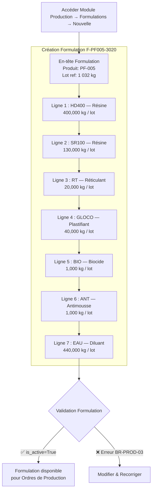

# UsineERP — Scénario QA/QC : Formulation 3020 (Colle Industrielle)

## Formulation → Ordre de Production → QA/QC Gates B/C

> **Document** : Spécification fonctionnelle d'exécution
> **Produit fini cible** : `PF-005 — Colle Industrielle Formule 3020`
> **Formulation** : `F-PF005-3020` (référencée `3020` dans le scénario §4.4 du document
> `scenario_bidon_vert_full_cycle_fresh_db.md`)
> **Objet** : ce scénario remplace le Bidon PEHD 15L Vert (PF-001) comme support de
> démonstration QA/QC — il utilise la Formulation 3020 (8 matières premières partagées
> HD400/SR100/RT/GLOCO/LS/BIO/ANT/EAU) pour illustrer la formule de production, l'Ordre
> de Production qui en découle, et les deux gates qualité qui s'y appliquent (B et C).

---

## Table des matières

1. [Pré-requis](#1-pré-requis)
2. [Données de référence](#2-données-de-référence)
3. [Formule de production — Formulation 3020](#3-formule-de-production--formulation-3020)
4. [Ordre de Production OP-2026-3020](#4-ordre-de-production-op-2026-3020)
5. [QA/QC — Gate B (mi-production)](#5-qaqc--gate-b-mi-production)
6. [QA/QC — Gate C (libération finale)](#6-qaqc--gate-c-libération-finale)
7. [Scénario alternatif — échec Gate C & NCR](#7-scénario-alternatif--échec-gate-c--ncr)
8. [Analyse de rendement](#8-analyse-de-rendement)
9. [Ce que ça démontre](#9-ce-que-ça-démontre)

---

## 1. Pré-requis

```
python manage.py migrate
python manage.py minimal_populate_db --flush
python manage.py seed_phase0_bidon_vert                        # rôles qualite / laboratoire
python manage.py seed_phase1c_supplier_bl_multi_formulations    # MP HD400..EAU + BL validé
```

Le seed `seed_phase1c_supplier_bl_multi_formulations` crédite déjà le stock MP nécessaire
(HD400 +870, SR100 +440, RT +51, GLOCO +50, BIO +3, ANT +3, EAU +1320 kg — LS reste à 0,
aucune ligne). Ce scénario part de cet état : catalogue MP + stock MP disponibles, mais
**aucune Formulation, aucun produit fini PF-005 et aucun plan d'échantillonnage Gate
B/C n'existent encore** — ce sont les objets créés ci-dessous.

---

## 2. Données de référence

### 2.1 Produit fini

| Champ                         | Valeur                             |
| ------------------------------ | ----------------------------------- |
| Référence                     | `PF-005`                            |
| Désignation                   | Colle Industrielle Formule 3020     |
| Unité de vente                | Kilogramme (kg)                     |
| Prix de vente de référence HT | **180,00 DZD/kg**                   |
| Seuil d'alerte stock          | 100 kg                              |

> Hypothèse de nommage : la Formulation 3020 (§4.4 du scénario Bidon Vert) n'était rattachée
> à aucun produit fini publié — `PF-005` est introduit ici comme cible pour pouvoir
> construire un Ordre de Production réel et exercer les gates B/C dessus.

### 2.2 Module QA/QC — plans actifs sur PF-005

| Cible   | Propriété               | Nominal        | Tolérance | Critique | Gate | Point de contrôle    |
| ------- | ------------------------ | -------------- | --------- | -------- | ---- | --------------------- |
| PF-005  | Viscosité (Brookfield)   | 3 500 mPa·s    | ± 15 %    | Oui      | B    | "Après mélange"       |
| PF-005  | Extrait sec              | 58,00 %        | ± 5 %     | Oui      | C    | —                      |
| PF-005  | pH                       | 7,50            | ± 10 %    | Non      | C    | —                      |

> Aucun plan Gate A n'est actif sur HD400/SR100/RT/GLOCO/LS/BIO/ANT/EAU (cf.
> `seed_phase1c_supplier_bl_multi_formulations` : "pas de plan → pas de gate", BR-QA-01) —
> leur BL a suivi le flux `draft → pending → validated` sans prélèvement. Ce scénario porte
> donc exclusivement sur les gates **B** et **C**, côté production.

---

## 3. Formule de production — Formulation 3020

### 3.1 Flux détaillé



> **LS (lubrifiant)** apparaît dans la matrice partagée des 8 MP mais avec une quantité de
> **0,000 kg** dans la Formulation 3020 (contrairement à la 3010/4010 où elle est également
> nulle) — aucune ligne `FormulationLine` n'est créée pour LS sur cette formulation, exactement
> comme le BL fournisseur n'a porté aucune ligne LS (§4.4 §1c).

### 3.2 Formulaire Formulation (`FormulationForm`)

```
Module  : PRODUCTION → Formulations → [Nouvelle]
Modèle  : Formulation

  designation           : "Formulation 3020 — Colle Industrielle"
  finished_product       : PF-005 — Colle Industrielle Formule 3020
  reference_batch_qty    : 1 032       ← kg, cf. §4.4 du scénario Bidon Vert
  reference_batch_unit   : KG
  expected_yield_pct     : 96,00       ← pertes de mélange/filtration estimées à 4%
  technical_notes         : "Process mélange à froid puis dispersion. Viscosité cible
                             3 500 mPa·s. pH ajusté en fin de cycle."

Lignes (FormulationLine) :
  ┌─────────────────────────────────────────────────────────────────────────────┐
  │ raw_material │ qty_per_batch │ unit_of_measure │ tolerance_pct │ % du lot    │
  ├──────────────┼───────────────┼─────────────────┼───────────────┼─────────────┤
  │ HD400        │  400,000      │ KG              │ 2,00          │ 38,8 %      │
  │ SR100        │  130,000      │ KG              │ 2,00          │ 12,6 %      │
  │ RT           │   20,000      │ KG              │ 5,00          │  1,9 %      │
  │ GLOCO        │   40,000      │ KG              │ 5,00          │  3,9 %      │
  │ BIO          │    1,000      │ KG              │ 10,00         │  0,1 %      │
  │ ANT          │    1,000      │ KG              │ 10,00         │  0,1 %      │
  │ EAU          │  440,000      │ KG              │ 5,00          │ 42,6 %      │
  └─────────────────────────────────────────────────────────────────────────────┘
  TOTAL : 1 032,000 kg — 100 %  — Coût matière du lot : 101 730,00 DZD
          (coût unitaire moyen 98,58 DZD/kg — cf. §4.4)

Action : [Enregistrer] → is_active = True
```

---

## 4. Ordre de Production OP-2026-3020

> Lot cible plus petit que le lot de référence de la formulation (1 032 kg) pour montrer
> le calcul proportionnel des besoins théoriques — comme pour PF-001 (100 pce vs 102 pce
> de référence).

### 4.1 Formulaire Ordre de Production (`ProductionOrderForm`)

```
Module  : PRODUCTION → Ordres de Production → [Nouveau]
Modèle  : ProductionOrder

  formulation   : "Formulation 3020 — Colle Industrielle"
  target_qty    : 1 000,000
  target_unit   : KG
  launch_date   : 2026-06-01
  notes         : "Premier lot de production PF-005 — test gates B/C"

Action : [Enregistrer] → status = "draft"
Action : [Lancer]      → status = "in_progress"
         ↳ Création automatique des ConsumptionLines (théoriques),
           facteur d'échelle = 1 000 / 1 032 = 0,96899
```

### 4.2 Besoins théoriques en MP (facteur ×0,96899)

| Matière | Qté/lot 1 032 kg | Qté théorique (×0,96899) | % du lot | Stock avant | Suffisant ? |
| ------- | ---------------: | ------------------------: | -------: | ----------: | :---------: |
| HD400   | 400,000           | **387,60 kg**              | 38,76 %  | 870,000 kg  | ✅          |
| SR100   | 130,000           | **125,97 kg**              | 12,60 %  | 440,000 kg  | ✅          |
| RT      |  20,000           | **19,38 kg**                |  1,94 %  |  51,000 kg  | ✅          |
| GLOCO   |  40,000           | **38,76 kg**                |  3,88 %  |  50,000 kg  | ✅          |
| BIO     |   1,000           | **0,97 kg**                 |  0,10 %  |   3,000 kg  | ✅          |
| ANT     |   1,000           | **0,97 kg**                 |  0,10 %  |   3,000 kg  | ✅          |
| EAU     | 440,000           | **426,36 kg**               | 42,64 %  | 1 320,000 kg| ✅          |
| **TOTAL** | **1 032,000**  | **1 000,01 kg**            | 100 %    | —           | —           |

> Vérification de stock au lancement (BR-PROD-01) : toutes les lignes disposent d'un stock
> suffisant → l'OP passe à `in_progress` sans blocage.

---

## 5. QA/QC — Gate B (mi-production)

Pendant que l'OP `OP-2026-3020` est `in_progress`, un technicien QC prélève un échantillon
après le mélange, depuis la fiche de l'OP (bouton **[Prélever un échantillon]**, visible
car un plan Gate B actif existe sur PF-005) :

```
Qualité → Échantillons → [Prélever un échantillon] (depuis OP-2026-3020)
  Formulaire "Prélever un échantillon — Gate B" (SampleDrawForm) :

    Point de contrôle suggéré : [Après mélange]  ← bouton, pré-remplit le champ ci-dessous
    Version de spécification (verrouillée — BR-QA-04) : PF-005 - Colle Industrielle — v1
    Quantité échantillonnée   : 0,250
    Unité                     : KG
    Point de contrôle (Gate B) : "Après mélange"

  [Enregistrer le prélèvement] → Référence auto : ECH-2026-0010
    → statut échantillon = "Résultats en attente"

Qualité → Échantillons → ECH-2026-0010 → Saisie des résultats (TestResultForm)
  | Propriété               | Nominal / Limites   | Critique | Valeur relevée | Instrument            |
  |--------------------------|----------------------|----------|------------------|-------------------------|
  | Viscosité (Brookfield)  | 3 500 ± 15,00 %      | Critique | 3 610 mPa·s      | Viscosimètre Brookfield |

  [Enregistrer les résultats]
  → Calcul auto : nominal 3 500 ± 15 % = [2 975 ; 4 025] → 3 610 ∈ tolérance → Conforme

→ Aucune alerte levée. L'OP reste in_progress sans interruption.
```

> Si la viscosité relevée était sortie de tolérance (ex. 4 300 mPa·s), l'échantillon
> passerait `non_conforming`, un **hold qualité non bloquant** apparaîtrait sur l'OP, et le
> Responsable Production devrait l'**acquitter** (avec une note) avant de pouvoir déclarer
> les résultats — sans interrompre le mélange en cours (BR-QA-07).

---

## 6. QA/QC — Gate C (libération finale)

### 6.1 Déclaration des résultats de production

```
Action : [Déclarer les résultats]

  actual_qty_produced : 968,000    ← rendement réel 96,80% (vs 96,00% formulé)
  notes               : "Léger surdosage EAU en fin de cycle pour ajuster la viscosité"

Consommations réelles saisies :
  consumption_<HD400> : 388,200 kg
  consumption_<SR100> : 126,400 kg
  consumption_<RT>    :  19,500 kg
  consumption_<GLOCO> :  38,900 kg
  consumption_<BIO>   :   0,980 kg
  consumption_<ANT>   :   0,970 kg
  consumption_<EAU>   : 431,000 kg

Résultat immédiat :
  Statut OP  : "Pending QC Release" (plan Gate C actif sur PF-005)
  Stock HD400 ↓ -388,200 kg  (reste : 481,800 kg)   ← déduit tout de suite (BR-QA-06)
  Stock SR100 ↓ -126,400 kg  (reste : 313,600 kg)
  Stock RT    ↓  -19,500 kg  (reste :  31,500 kg)
  Stock GLOCO ↓  -38,900 kg  (reste :  11,100 kg)
  Stock BIO   ↓   -0,980 kg  (reste :   2,020 kg)
  Stock ANT   ↓   -0,970 kg  (reste :   2,030 kg)
  Stock EAU   ↓ -431,000 kg  (reste : 889,000 kg)
  Stock PF-005            : INCHANGÉ — pas encore crédité (BR-QA-03)
```

### 6.2 Prélèvement et résultats Gate C

```
Qualité → Échantillons → [Prélever un échantillon] (depuis OP-2026-3020, "Pending QC Release")
  Formulaire "Prélever un échantillon — Gate C" (pas de point de contrôle nommé) :

    Version de spécification (verrouillée — BR-QA-04) : PF-005 - Colle Industrielle — v1
    Quantité échantillonnée   : 0,500
    Unité                     : KG

  [Enregistrer le prélèvement] → Référence auto : ECH-2026-0011

Qualité → Échantillons → ECH-2026-0011 → Saisie des résultats (TestResultForm)
  | Propriété    | Nominal / Limites | Critique | Valeur relevée |
  |---------------|--------------------|----------|------------------|
  | Extrait sec   | 58,00 % ± 5,00 %  | Critique | 57,10 %          |
  | pH            | 7,50 ± 10,00 %    | Non      | 7,65             |

  [Enregistrer les résultats]
  → Extrait sec : nominal 58,00 ± 5 % = [55,10 ; 60,90] → 57,10 ∈ tolérance → Conforme
  → pH          : nominal 7,50 ± 10 % = [6,75 ; 8,25]  → 7,65 ∈ tolérance → Conforme

Vérification quantitative (automatique, ConsumptionLines vs théorique) :
  HD400 : 388,200 / 387,600 = +0,15 % (tolérance ±2 %)  → OK
  SR100 : 126,400 / 125,970 = +0,34 % (tolérance ±2 %)  → OK
  RT    :  19,500 /  19,380 = +0,62 % (tolérance ±5 %)  → OK
  GLOCO :  38,900 /  38,760 = +0,36 % (tolérance ±5 %)  → OK
  BIO   :   0,980 /   0,970 = +1,03 % (tolérance ±10 %) → OK
  ANT   :   0,970 /   0,970 =  0,00 % (tolérance ±10 %) → OK
  EAU   : 431,000 / 426,360 = +1,09 % (tolérance ±5 %)  → OK
  → yield_status = "normal" (96,80 %) → aucune revue obligatoire (BR-QA-10)

Bouton [Libérer / Statuer] (rôle qualite) :
  → Échantillon conforme + écarts dans tolérance → LIBÉRATION DIRECTE
  Statut OP  : "Completed"
  Stock PF-005 ↑ +968,000 kg
```

---

## 7. Scénario alternatif — échec Gate C & NCR

> À rejouer sur un second OP (`OP-2026-3021`) pour démontrer le chemin non conforme,
> distinct du lot conforme ci-dessus.

- Mêmes étapes 4 à 6.1, mais l'extrait sec mesuré à la libération est **51,80 %** (hors
  tolérance basse de [55,10 ; 60,90]) — critère marqué **critique**.
- Conséquence automatique :
  - Statut OP → `Completed — Under Investigation`.
  - Une **NCR** est auto-ouverte et pré-remplie avec l'écart détecté (extrait sec −10,7 %
    vs nominal).
  - Stock PF-005 reste **inchangé** (aucun crédit) tant que la NCR n'est pas dispositionnée
    (BR-QA-03).
- Traitement NCR (rôle `qa_manager`) :
  1. **Instruction** — pièce justificative jointe (ex. relevé du laboratoire).
  2. **Disposition** — cause racine renseignée (ex. sous-dosage EAU/HD400 en fin de
     mélange) ; action retenue : *Rework* (remélange avec correctif) ou *Rebut* (aucun
     crédit stock).
  3. **Clôture** — la NCR passe à "clôturé" ; si disposition = Rework et le nouveau contrôle
     est conforme, l'OP passe alors à `Completed` et crédite le stock ; si Rebut, le stock
     PF-005 ne reçoit jamais ce lot.

---

## 8. Analyse de rendement

| Indicateur                   | Valeur              |
| ----------------------------- | -------------------- |
| Quantité cible                | 1 000,000 kg          |
| Quantité réellement produite  | **968,000 kg**        |
| Rendement théorique formulé   | 96,00 %                |
| Rendement réel                | **96,80 %**           |
| Écart rendement                | +0,80 %                |
| Coût matière réel / lot        | **≈ 98 850,00 DZD**    |
| Coût matière réel / kg          | **≈ 102,12 DZD/kg**    |

---

## 9. Ce que ça démontre

- Une **formule de production** (Formulation 3020) partagée entre plusieurs produits
  finis dans le catalogue de démonstration peut être rattachée à un produit fini réel
  (`PF-005`) et pilotée via un **Ordre de Production** classique — mêmes calculs
  proportionnels (facteur d'échelle, % du lot) que pour PF-001.
- Les gates **B** (mi-production, propriété critique unique — viscosité) et **C**
  (libération finale, deux propriétés dont une critique + vérification quantitative des
  écarts de consommation) s'appliquent indépendamment du produit : rien n'est codé en dur
  pour "PEHD" ou "bidon" — seul un **plan d'échantillonnage actif** déclenche le contrôle
  (BR-QA-01).
- Le chemin non conforme (§7) montre que le stock produit fini n'est **jamais crédité**
  tant qu'une NCR ouverte sur le lot n'a pas été dispositionnée et clôturée par le rôle QA,
  y compris quand seule une propriété critique est en cause et que le reste (pH, écarts de
  consommation) reste conforme.

---

_Fin du document — UsineERP Scénario QA/QC PF-005 — Formulation 3020_
